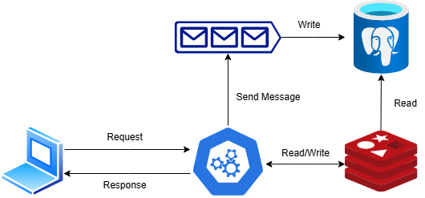

# Microserviço de Carrinho de Compras — Sistema de E-commerce

### Visão Geral
Este repositório contém o **microserviço de carrinho de compras** desenvolvido com **Spring Boot** e **Java 17**, projetado para oferecer uma arquitetura de e-commerce escalável e de alto desempenho. O microserviço gerencia as operações de carrinho de compras, proporcionando uma experiência rápida e eficiente para os usuários finais.

---
### Arquitetura do Microserviço

<div align="center">
  
</div>

#### Descrição
A arquitetura do microserviço de carrinho de compras foi projetada para oferecer alta performance e escalabilidade, com os seguintes componentes:

1. **Cliente (Frontend ou Aplicativo Mobile)**:  
   Envia requisições para adicionar, atualizar, visualizar ou remover produtos do carrinho.

2. **Cart Microservice (Spring Boot)**:  
   Recebe as requisições REST e realiza operações no cache ou em filas para garantir baixa latência e alta confiabilidade.

3. **Redis (Cache)**:  
   Serve como cache para armazenar temporariamente os dados do carrinho, garantindo respostas rápidas para o cliente.

4. **RabbitMQ (Fila de Mensagens)**:  
   As mensagens de atualização do carrinho são enviadas para a fila RabbitMQ, permitindo o processamento assíncrono e desacoplado dos dados.

5. **PostgreSQL (Banco de Dados)**:  
   Persistência final dos dados do carrinho após serem processados pela fila. Garante durabilidade e consistência.

#### Fluxo de Dados
1. O cliente faz uma requisição para o microserviço.
2. O microserviço armazena os dados no **Redis** e retorna a resposta ao cliente imediatamente, proporcionando uma experiência rápida.
3. Os dados são enviados para uma **fila RabbitMQ** para processamento assíncrono.
4. A mensagem é consumida e os dados são finalmente persistidos no banco de dados **PostgreSQL**.

#### Benefícios desta Arquitetura
- **Alta Performance**: Utiliza cache para respostas instantâneas.
- **Escalabilidade**: RabbitMQ permite processamento distribuído e assíncrono.
- **Confiabilidade**: Garantia de que os dados não serão perdidos com a persistência no banco de dados.


---

### Arquitetura e Tecnologias
- **Spring Boot**: Framework para desenvolvimento ágil e robusto de aplicações Java.
- **Redis**: Cache para armazenamento temporário dos dados do carrinho, garantindo resposta imediata.
- **RabbitMQ**: Sistema de mensageria para comunicação assíncrona e envio seguro de dados.
- **PostgreSQL**: Banco de dados relacional para persistência final.
- **Docker**: Utilizado para empacotamento e execução dos serviços em ambientes isolados.

---

### Objetivos
Este microserviço foi desenvolvido para:
- Garantir **alta performance e responsividade** ao cliente final.
- Minimizar latência com **cache Redis** como camada de armazenamento inicial.
- Assegurar a **durabilidade e integridade dos dados**:
  - Os produtos adicionados ao carrinho são armazenados no Redis.
  - Posteriormente, são enviados para uma **fila RabbitMQ** para processamento assíncrono.
  - Finalmente, os dados são persistidos no banco de dados **PostgreSQL**.

---

### Endpoints da REST API

| Método | Endpoint                     | Descrição                                   |
|--------|------------------------------|---------------------------------------------|
| `POST` | `/api/v1/cart`                | Adiciona produtos ao carrinho.              |
| `GET`  | `/api/v1/cart/{id}`           | Retorna o conteúdo do carrinho pelo ID.     |
| `PATCH`| `/api/v1/cart`                | Atualiza a quantidade de produtos no carrinho. Use `"action": "increment"` para aumentar e `"action": "decrement"` para diminuir. |
| `DELETE` | `/api/v1/cart`              | Remove um produto do carrinho.              |

---

### Vantagens
- **Experiência Rápida**: O uso de cache permite resposta visual imediata, melhorando a interatividade.
- **Alta Performance**: O RabbitMQ desacopla a lógica de persistência, melhorando a escalabilidade.
- **Confiabilidade**: A arquitetura previne perda de dados com persistência final no banco de dados.

---

### Próximos Passos
- Integração com um **API Gateway** para roteamento inteligente e balanceamento de carga.
- Implantação na **nuvem (AWS ou Azure)** para alta disponibilidade.
- Desenvolvimento de outros microserviços, incluindo **catálogo de produtos**, **processamento de pagamentos**, e **gestão de pedidos**.

---

### Como Executar
1. Clone o repositório:
   ```bash
   git clone https://github.com/Cavasini/Cart-Microsservice.git
2. Inicie os containers Docker para Redis, RabbitMQ e PostgreSQL.
      ```bash
    cd Cart-Microsservice/CartMicroservice
    docker-compose up -d
4. Execute o microserviço com:
   ```bash
   mvn spring-boot:run
  
